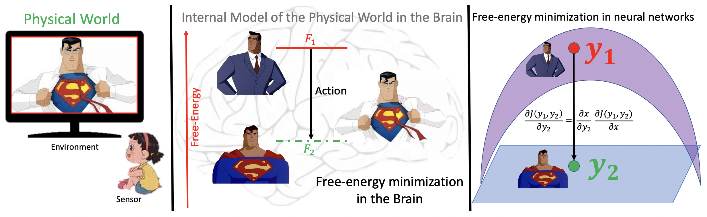

# Stochastic Surprisal: An inferential measurement of Free Energy in Neural Networks

Code used in the paper "Stochastic Surprisal: : An inferential measurement of Free Energy in Neural Networks", Frontiers in Neroscience, Vol 17, 2023. This article is part of the Research Topic: Scene-Dependent Image Quality and Visual Assessment

**Citation:** M. Prabhushankar and G. AlRegib, "Stochastic Surprisal: An inferential measurement of Free Energy in Neural Networks," *Frontiers in Neuroscience*, 17, 2023.

This work is done in the [OLIVES @ Georgia Institute of Technology](https://ghassanalregib.info/)

### Toy Example: Free Energy Principle in action

The Free Energy Principle (FEP) proposes a theory to explain the self-organizing capability of any intelligent and adaptive system [1]. FEP assumes the demarcation of a *system* that exists in an *environment* through a functional *Markov Blanket*. The Markov Blanket provides statistical independence to the system from its environment, thereby imbuing the system with a sense of *self*. A consequence of this separation is that the system only experiences the environment through the Markov Blanket based on a limited set of sensory inputs. These sensory inputs are used to create a generative model of the outside environment within the system. The system then performs a limited set of actions affecting the outside environment while updating its internal model of the outside environment. This way, the environment and the model are made to fit each other by reducing the mismatched input.

## Abstract

This paper conjectures and validates a framework that allows for action during inference in supervised neural networks. Supervised neural networks are constructed with the objective to maximize their performance metric in any given task. This is done by reducing free energy and its associated surprisal during training. However, the bottom-up inference nature of supervised networks is a passive process that renders them fallible to noise. In this paper, we provide a thorough background of supervised neural networks, both generative and discriminative, and discuss their functionality from the perspective of free energy principle. We then provide a framework for introducing action during inference. We introduce a new measurement called stochastic surprisal that is a function of the network, the input, and any possible action. This action can be any one of the outputs that the neural network has learnt, thereby lending *stochasticity* to the measurement. Stochastic surprisal is validated on two applications: Image Quality Assessment and Recognition under noisy conditions. We show that, while noise characteristics are ignored to make robust recognition, they are analyzed to estimate image quality scores. We apply stochastic surprisal on two applications, three datasets, and as a plug-in on twelve networks. In all, it provides a statistically significant increase among all measures. We conclude by discussing the implications of the proposed stochastic surprisal in other areas of cognitive psychology including expectancy-mismatch and abductive reasoning. 

## Usage

The demo codes for both the Image Quality Assessment and Robust Recognition are provided in separate folders.

**Release 1 (February 10, 2023): Image Quality Assessment codes released** 

In this release, we provide the MATLAB codes for UNIQUE and the proposed Stochastic Surprisal as a plug-in on UNIQUE. All the necessary demo codes, images, and .mat files are provided.

**Release 2: Robust Recognition** 

Forthcoming

